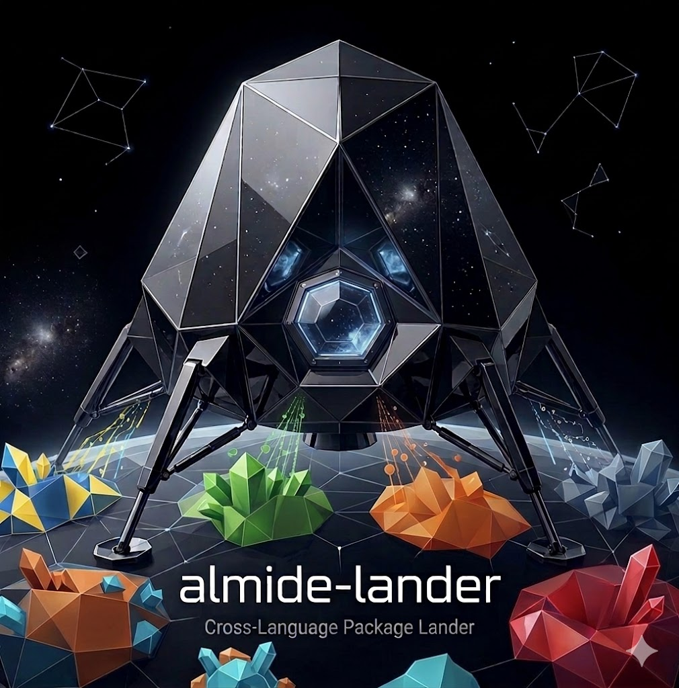

<p align="center">
  
</p>

<p align="center">
  Export Almide modules as native packages for 14 languages.
</p>

<p align="center">
  
  
  
  
  
  
  
  <br>
  
  
  
  
  
  
  
</p>

<p align="center">
  <a href="https://github.com/almide/almide">Almide</a> ·
  <a href="https://github.com/almide/almide-bindgen">almide-bindgen</a> ·
  <a href="https://github.com/almide/playground">Playground</a>
</p>

---

## What is this?

Write a library in Almide. Run one command. Use it from Python, Go, Swift, Ruby, C#, Dart, Kotlin, Java, C, Zig, Nim, Elixir, PHP, or Lua.

```bash
cd almide-lander
almide run src/main.almd -- --lang python mylib.almd
```

No runtime. No VM. Almide disappears — only a native shared library and a pure language wrapper remain.

## How it works

```
mylib.almd
    │
    ▼
almide run src/main.almd -- --lang python mylib.almd
    │
    ├─ [1/4] almide compile --json    → interface.json
    ├─ [2/4] almide --target rust     → source.rs
    ├─ [3/4] bindgen.scaffolding.generate()  → src/lib.rs → cargo build → .dylib
    └─ [4/4] bindgen.bindings.python.generate()  → almide_mathlib.py
    │
    ▼
python3 -c "from almide_mathlib import Point, distance; print(distance(Point(x=0,y=0), Point(x=3,y=4)))"
# → 5.0
```

## Architecture

almide-lander is a CLI tool. The binding generation logic lives in [almide-bindgen](https://github.com/almide/almide-bindgen), which is imported as an Almide library.

```
almide-bindgen (library)              almide-lander (this repo, CLI)
├── src/mod.almd                      ├── almide.toml → depends on bindgen
├── src/scaffolding.almd              └── src/main.almd → import bindgen
└── src/bindings/ (14 languages)            calls bindgen.scaffolding.generate()
                                            calls bindgen.bindings.python.generate()
```

Everything is written in Almide. No Python, no JavaScript, no external tool dependencies.

## Demo

```almide
import math

type Point = { x: Float, y: Float }
type Shape = Circle(Float) | Rect(Float, Float)

fn distance(a: Point, b: Point) -> Float = {
  let dx = a.x - b.x
  let dy = a.y - b.y
  math.sqrt(dx * dx + dy * dy)
}

fn area(shape: Shape) -> Float = match shape {
  Circle(r) => math.pi() * r * r,
  Rect(w, h) => w * h,
}
```

**Python**
```python
from almide_mathlib import Point, Shape, distance, area

distance(Point(x=0, y=0), Point(x=3, y=4))  # 5.0
area(Shape.circle(5.0))                       # 78.54
```

**Go**
```go
d := almide.Distance(almide.Point{X: 0, Y: 0}, almide.Point{X: 3, Y: 4})  // 5.0
```

**Swift**
```swift
let d = Mathlib.distance(Point(x: 0, y: 0), Point(x: 3, y: 4))  // 5.0
```

## License

MIT
